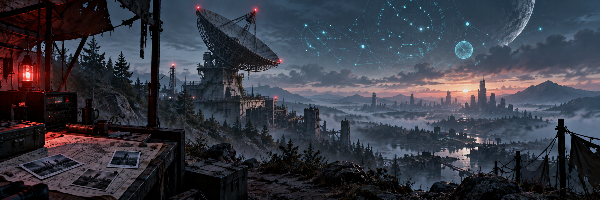

<!-- project-centered:start -->

<h1 align="center">Dead Signal</h1>

<!-- project-header:start -->

<!-- project-header:end -->

<!-- project-badges:start -->

  

<!-- project-badges:end -->

<!-- project-live-badges:start -->

  

<!-- project-live-badges:end -->

<!-- project-index:start -->

<h3 align="center">✦ Explore this project</h3>
<table align="center"><tbody><tr><td align="center"><a href="#readme-overview"><strong>Overview</strong></a></td><td align="center"><a href="#readme-repository-layout"><strong>Repository layout</strong></a></td></tr><tr><td align="center"><a href="#readme-deployment"><strong>Deployment</strong></a></td><td align="center"><a href="#readme-working-rules"><strong>Working rules</strong></a></td></tr></tbody></table>
<h4 align="center">Project shortcuts</h4>
<table align="center"><tbody><tr><td align="center"><a href="AI-CONTINUITY.md"><strong>AI-CONTINUITY</strong></a></td><td align="center"><a href="PROJECT-RULES.md"><strong>PROJECT-RULES</strong></a></td></tr><tr><td align="center"><a href="HANDOFF-CURRENT.md"><strong>HANDOFF-CURRENT</strong></a></td><td align="center"><a href="https://github.com/raiinman/dead-signal/tree/main/tools/miner"><strong>tools/miner</strong></a></td></tr></tbody></table>
<!-- project-index:end -->

<h2 align="center">Overview</h2>

Dead Signal is an independent, data-driven Once Human build-planning project. The planner is the product; the root website is a lightweight landing page that introduces it.

<table align="center"><tbody><tr><td align="center">Website: <code>https://deadsignaldb.com/</code></td></tr><tr><td align="center">Build Planner: <code>https://deadsignaldb.com/build-planner/</code></td></tr></tbody></table>

<a href="#readme-index">↑ Back to index</a>

## Repository layout

<table align="center"><tbody><tr><td align="center"><code>index.html</code>, <code>site.css</code>, <code>site.js</code> — static root landing page.</td></tr><tr><td align="center"><code>preview/build-lab/</code> — production planner presentation files. The directory name is historical; do not treat it as disposable preview output.</td></tr><tr><td align="center"><code>shared/</code> — shared readability controls used across Dead Signal interfaces.</td></tr><tr><td align="center"><code>deploy/</code> — required prepared planner bundles and patches used by the current deployment path.</td></tr><tr><td align="center"><code>tools/miner/</code> — canonical Miner source, tests, build support, and updater metadata.</td></tr><tr><td align="center"><code>concepts/</code> — isolated design explorations; not production deployment inputs.</td></tr><tr><td align="center"><code>archive/</code> — superseded continuity records retained for history.</td></tr><tr><td align="center"><code>RELEASE-v*.md</code> — historical planner release notes retained at the root pending a deliberate documentation migration.</td></tr></tbody></table>

No WordPress or PHP runtime is required.

<a href="#readme-index">↑ Back to index</a>

## Deployment

Dead Signal uses cPanel Git Version Control from `main`:

<table align="center"><tbody><tr><td align="center">1</td><td align="center">Update from Remote.</td></tr><tr><td align="center">2</td><td align="center">Deploy HEAD Commit.</td></tr></tbody></table>

`.cpanel.yml` performs copy-only deployment:

<table align="center"><tbody><tr><td align="center">root landing files → <code>$HOME/public_html/</code></td></tr><tr><td align="center">planner files → <code>$HOME/public_html/build-planner/</code></td></tr></tbody></table>

Builds, data transforms, downloads, and archive extraction must happen before deployment, never in cPanel. Persistent player-facing PNGs remain on the server under `build-planner/assets/reference-images/`.

<a href="#readme-index">↑ Back to index</a>

## Working rules

Read `AI-CONTINUITY.md` and `PROJECT-RULES.md` before making changes. Preserve the planner, mined-data provenance, Miner source, and uncertainty around unproven game mechanics.

<a href="#readme-index">↑ Back to index</a> · <a href="#readme-top">Back to top ↑</a>

<!-- project-centered:end -->
